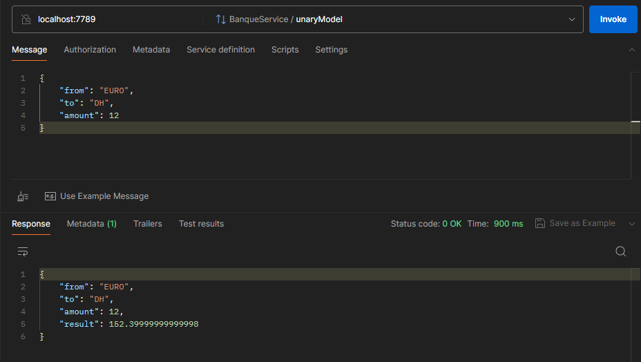

# Les micro-services avec gRPC 


Dans cette activité, nous essayerons de créer un micro-service basé sur gRPC (**G**oogle **R**emote **P**rocedural **C**all).

La première étape pour un micro-service gRPC c'est de créer le fichier proto (qui a comme extension `.proto`), après, on génère le code pour la partie `Server` et `Client`.

La structure de notre projet pour cette activité est comme ceci :

on a deux modules :
* `gRPC-server`: module dans lequel on va créer le serveur gRPC.
* `gRPC-clients`: dans lequel on va définir les clients gRPC, pour chaque `modèle de communication gRPC` :
    - `unary model`: modèle de communication simple (request - response).
    - `server streaming`: modèle de communication dans lequel le client envoie une requete et le serveur gRPC répondre avec un `flux de d'éléments`.
    - `client streaming`: cette fois le client celui qui envoie un `flux de requete` et lorsqu'il termine le serveur renvoie sa réponse.
    - `bi-directionnel streaming`: les deux entités (client et serveur) échangent des `flux de requete et réponse`.


 
## Définition du fichier proto

Notre fichier `schema.proto` contient la définition de notre service, et l'ensemble des objets échangés :

```protobuf
syntax="proto3";
option java_package="hajji.mohammed.stubs";


service BanqueService {
  rpc unaryModel(ObjectRequest) returns (ObjectResponse);
  rpc serverStreamModel(ObjectRequest) returns (stream ObjectResponse);
  rpc clientStreamModel(stream ObjectRequest) returns (ObjectResponse);
  rpc fullStreamModel(stream ObjectRequest) returns (stream ObjectResponse);
}

message ObjectRequest {
  Currency from = 1;
  Currency to = 2;
  double amount = 3;
}

message ObjectResponse {
  Currency from = 1;
  Currency to = 2;
  double amount = 3;
  double result = 4;
}

enum Currency {
  UNKNOWN = 0;
  EURO = 1;
  USD = 2;
  DH = 3;
}
```

Dans ce fichier, on a déclaré un service `BanqueService` avec les méthodes:
* `unaryModel`: pour le modèle de communication simple.
* `serverStreamModel`: pour le modèle de communication avec `server streaming`.
* `clientStreamModel`: pour le modèle de communication avec `client streaming`.
* `fullStreamModel`: pour le modèle de communication avec `bi-directionnal streaming`.

Plus les objets qui vont etres transférés lors de l'invocation de ces méthodes :
* `ObjectRequest`: le type des objets envoyés par le client et recus par le serveur.
* `ObjectResponse`: le type des objets envoyés par le serveur et recus par le client.

Plus une `énumeration` pour représenter les devices.

## Création du serveur gRPC

On a dit que le serveur gRPC est représenté par le module `gRPC-server`.


Le package `hajji.mohammed.stubs` est généré à partir du fichier `schema.proto` qui se trouve dans le dossier `src/main/ressources`.

Pour la génération de ce package, on a utilisé les dépendances et le plugin suivants :

```xml
<dependencies>
        <!-- https://mvnrepository.com/artifact/com.google.protobuf/protobuf-java -->
        <dependency>
            <groupId>com.google.protobuf</groupId>
            <artifactId>protobuf-java</artifactId>
            <version>3.22.0</version>
        </dependency>
        <!-- https://mvnrepository.com/artifact/io.grpc/grpc-netty-shaded -->
        <dependency>
            <groupId>io.grpc</groupId>
            <artifactId>grpc-netty-shaded</artifactId>
            <version>1.64.0</version>
        </dependency>
        <!-- https://mvnrepository.com/artifact/io.grpc/grpc-protobuf -->
        <dependency>
            <groupId>io.grpc</groupId>
            <artifactId>grpc-protobuf</artifactId>
            <version>1.64.0</version>
        </dependency>
        <!-- https://mvnrepository.com/artifact/io.grpc/grpc-stub -->
        <dependency>
            <groupId>io.grpc</groupId>
            <artifactId>grpc-stub</artifactId>
            <version>1.53.0</version>
        </dependency>
        <dependency>
            <groupId>javax.annotation</groupId>
            <artifactId>javax.annotation-api</artifactId>
            <version>1.3.2</version>
        </dependency>
    </dependencies>

    <build>
        <plugins>
            <plugin>
                <groupId>com.github.os72</groupId>
                <artifactId>protoc-jar-maven-plugin</artifactId>
                <version>3.11.4</version>
                <executions>
                    <execution>
                        <phase>generate-sources</phase>
                        <goals>
                            <goal>run</goal>
                        </goals>
                        <configuration>
                            <includeMavenTypes>direct</includeMavenTypes>
                            <inputDirectories>
                                <include>src/main/resources</include>
                            </inputDirectories>
                            <outputTargets>
                                <outputTarget>
                                    <type>java</type>
                                    <outputDirectory>src/main/java</outputDirectory>
                                </outputTarget>
                                <outputTarget>
                                    <type>grpc-java</type>
                                    <pluginArtifact>io.grpc:protoc-gen-grpc-java:1.15.0</pluginArtifact>
                                    <outputDirectory>src/main/java</outputDirectory>
                                </outputTarget>
                            </outputTargets>
                        </configuration>
                    </execution>
                </executions>
            </plugin>
        </plugins>
    </build>

```


Dans le package `hajji.mohammed.impl`, on a réalisé l'implémentation du service déclaré dans le fichier `schema.proto`.

```java
public class BanqueService extends BanqueServiceGrpc.BanqueServiceImplBase {


    @Override
    public void unaryModel(Schema.ObjectRequest request, StreamObserver<Schema.ObjectResponse> responseObserver) {
        Schema.Currency from = request.getFrom();
        Schema.Currency to = request.getTo();
        double amount = request.getAmount();

        Schema.ObjectResponse response = Schema.ObjectResponse.newBuilder()
                .setFrom(from)
                .setTo(to)
                .setAmount(amount)
                .setResult(amount * 12.7)
                .build();

        responseObserver.onNext(response);
        responseObserver.onCompleted();
    }

    @Override
    public void serverStreamModel(Schema.ObjectRequest request, StreamObserver<Schema.ObjectResponse> responseObserver) {

        Schema.Currency from = request.getFrom();
        Schema.Currency to = request.getTo();
        double amount = request.getAmount();

        Timer timer = new Timer();
        timer.schedule(
                new TimerTask() {
                    int counter = 0;
                    @Override
                    public void run() {
                        Schema.ObjectResponse response = Schema.ObjectResponse.newBuilder()
                                .setFrom(from)
                                .setTo(to)
                                .setAmount(amount)
                                .setResult(amount * Math.random() * 10)
                                .build();

                        responseObserver.onNext(response);

                        counter += 1;
                        if (counter == 10){
                            responseObserver.onCompleted();
                            timer.cancel();
                        }
                    }
                },
                1000,
                1000
        );

    }

    @Override
    public StreamObserver<Schema.ObjectRequest> clientStreamModel(StreamObserver<Schema.ObjectResponse> responseObserver) {

        return new StreamObserver<Schema.ObjectRequest>() {
            private final DoubleStream.Builder amountStreamBuilder = DoubleStream.builder();
            @Override
            public void onNext(Schema.ObjectRequest objectRequest) {
                //add new amount to amount stream:
                System.out.println(objectRequest.getAllFields());
                amountStreamBuilder.accept(objectRequest.getAmount());
            }

            @Override
            public void onError(Throwable throwable) {

            }

            @Override
            public void onCompleted() {

                double sum = amountStreamBuilder.build()
                        .sum();

                Schema.ObjectResponse response = Schema.ObjectResponse.newBuilder()
                        .setResult(sum * 12.7)
                        .build();

                responseObserver.onNext(response);
                responseObserver.onCompleted();

            }
        };
    }

    @Override
    public StreamObserver<Schema.ObjectRequest> fullStreamModel(StreamObserver<Schema.ObjectResponse> responseObserver) {
        return new StreamObserver<Schema.ObjectRequest>() {
            private final DoubleStream.Builder amountStreamBuilder = DoubleStream.builder();
            @Override
            public void onNext(Schema.ObjectRequest objectRequest) {
                Schema.ObjectResponse response = Schema.ObjectResponse.newBuilder()
                        .setFrom(objectRequest.getFrom())
                        .setTo(objectRequest.getTo())
                        .setAmount(objectRequest.getAmount())
                        .setResult(objectRequest.getAmount() * 12.7)
                        .build();

                responseObserver.onNext(response);
            }

            @Override
            public void onError(Throwable throwable) {

            }

            @Override
            public void onCompleted() {
                responseObserver.onCompleted();
            }
        };
    }
}

```


Pour publier le service, on a créé la classe `GrpcServer` :

```java
public class GrpcServer {
    public static void main(String[] args) throws IOException, InterruptedException {

        Server grpcServer = ServerBuilder.forPort(7789)
                .addService(new BanqueService())
                .build();

        grpcServer.start();
        System.out.println("le serveur est démarré sur le port: 7789");
        grpcServer.awaitTermination();

    }
}
```

## Test des services gRPC avec Postman

La première étape avant de teseter le service, il faut démarrer le serveur:


Pour cette étape de test, on va utiliser `Postman`.

* `unary model`:



* `server stream model`:


* `client stream model`:

On commence à envoyer des requete un par un sous forme d'un flux de requetes :


Et lorsqu'on finit, on clique sur le boutton `End streaming`, et on va recevoir la réponse du serveur:


* `bi-directionnal stream model`:

Comme le streaming coté client, On commence à envoyer des requete un par un sous forme d'un flux de requetes, pour chaque envoie, on reçoit une réponse au pris du serveur :


Et lorsqu'on finit, on clique sur le boutton `End streaming`:


## Création d'un client gRPC Java

Dans cette étape, on a créé un client `Java`, qui est représenté par le module `gRPC-clients`:


Le fichier `schema.proto` est le meme que le fichier `schema.proto` qui existe dans le module 

[grpc-server](#création-du-serveur-grpc)

Plus on a utilisé les memes dépendances et plugin pour généré le package `hajji.mohammed.stubs` pour ce module.

Le package `hajji.mohammed.clients` contient l'implémentation de chaque client par modèle de communication:

* pour le `UnaryModelClient` qui implémente le modèle de communication simple avec un proxy bloquant :

```java
public class UnaryModelClient {

    public static void main(String[] args) {
        ManagedChannel channel = ManagedChannelBuilder.forAddress("localhost", 7789)
                .usePlaintext()
                .build();


        BanqueServiceGrpc.BanqueServiceBlockingStub banqueServiceBlockingStub = BanqueServiceGrpc.newBlockingStub(channel);

        Schema.ObjectRequest request = Schema.ObjectRequest.newBuilder()
                .setTo(Schema.Currency.DH)
                .setFrom(Schema.Currency.USD)
                .setAmount(78.0)
                .build();


        Schema.ObjectResponse response = banqueServiceBlockingStub.unaryModel(request);

        System.out.println(response);
        
    }
}
```

* pour le `AsyncUnaryModelClient`, le meme que `UnaryModelClient` sauf qu'on a utilisé un proxy (stub) non-bloquant :

```java
public class AsyncUnaryModelClient {
    public static void main(String[] args) throws IOException {
        ManagedChannel channel = ManagedChannelBuilder.forAddress("localhost", 7789)
                .usePlaintext()
                .build();


        BanqueServiceGrpc.BanqueServiceStub proxy = BanqueServiceGrpc.newStub(channel);

        Schema.ObjectRequest request = Schema.ObjectRequest.newBuilder()
                .setTo(Schema.Currency.DH)
                .setFrom(Schema.Currency.USD)
                .setAmount(78.0)
                .build();


        proxy.unaryModel(request, new StreamObserver<Schema.ObjectResponse>() {
            @Override
            public void onNext(Schema.ObjectResponse objectResponse) {
                System.out.println("-------------------");
                System.out.println(objectResponse);
            }

            @Override
            public void onError(Throwable throwable) {
                System.out.println("Error: " + throwable.getMessage());
            }

            @Override
            public void onCompleted() {
                System.out.println("<------------- completed ----------------->");
            }
        });

        System.in.read();


    }
}
```

* pour le `AsyncServerStreamClient`, qui consulte la méthode `serverStreamModel` du service :

```java
public class AsyncServerStreamClient {

    public static void main(String[] args) throws IOException {
        ManagedChannel channel = ManagedChannelBuilder.forAddress("localhost", 7789)
                .usePlaintext()
                .build();


        BanqueServiceGrpc.BanqueServiceStub proxy = BanqueServiceGrpc.newStub(channel);

        Schema.ObjectRequest request = Schema.ObjectRequest.newBuilder()
                .setTo(Schema.Currency.DH)
                .setFrom(Schema.Currency.USD)
                .setAmount(78.0)
                .build();


        proxy.serverStreamModel(request, new StreamObserver<Schema.ObjectResponse>() {
            @Override
            public void onNext(Schema.ObjectResponse objectResponse) {
                System.out.println("<---------------- New item received --------------->");
                System.out.println(objectResponse);
            }

            @Override
            public void onError(Throwable throwable) {
                System.out.println("Error: " + throwable.getMessage());
            }

            @Override
            public void onCompleted() {
                System.out.println("<------------- completed ----------------->");
            }
        });

        System.in.read();


    }
}
```

* pour le `AsyncClientStreamModelClient`, qui consulte la méthode `clientStreamModel` du service :

```java
public class AsyncClientStreamModelClient {

    public static void main(String[] args) throws IOException {
        ManagedChannel channel = ManagedChannelBuilder.forAddress("localhost", 7789)
                .usePlaintext()
                .build();


        BanqueServiceGrpc.BanqueServiceStub proxy = BanqueServiceGrpc.newStub(channel);


        StreamObserver<Schema.ObjectRequest> streamModel = proxy.clientStreamModel(new StreamObserver<Schema.ObjectResponse>() {
            @Override
            public void onNext(Schema.ObjectResponse objectResponse) {
                System.out.println("<---------------- Response received from server --------------->");
                System.out.println(objectResponse);
            }

            @Override
            public void onError(Throwable throwable) {
                System.out.println("Error: " + throwable.getMessage());
            }

            @Override
            public void onCompleted() {
                System.out.println("<------------- completed ----------------->");
            }
        });


        Timer timer = new Timer();
        timer.schedule(
                new TimerTask() {
                    int counter = 0;
                    @Override
                    public void run() {
                        Schema.ObjectRequest request = Schema.ObjectRequest.newBuilder()
                                .setTo(Schema.Currency.DH)
                                .setFrom(Schema.Currency.USD)
                                .setAmount(1.0)
                                .build();

                        streamModel.onNext(request);
                        System.out.println("sent request: " + request);

                        counter += 1;

                        if (counter == 10){
                            streamModel.onCompleted();
                            timer.cancel();
                        }

                    }
                },
                2000,
                1500
        );

        System.in.read();


    }
}

```

* pour le `AsyncBidirectionalStreamModelClient`, qui consulte la méthode `fullStreamModel` du service :

```java
public class AsyncBidirectionalStremModelClient {
    public static void main(String[] args) throws IOException {
        ManagedChannel channel = ManagedChannelBuilder.forAddress("localhost", 7789)
                .usePlaintext()
                .build();


        BanqueServiceGrpc.BanqueServiceStub proxy = BanqueServiceGrpc.newStub(channel);


        StreamObserver<Schema.ObjectRequest> streamModel = proxy.fullStreamModel(new StreamObserver<Schema.ObjectResponse>() {
            @Override
            public void onNext(Schema.ObjectResponse objectResponse) {
                System.out.println("<---------------- Response received from server --------------->");
                System.out.println(objectResponse);
            }

            @Override
            public void onError(Throwable throwable) {
                System.out.println("Error: " + throwable.getMessage());
            }

            @Override
            public void onCompleted() {
                System.out.println("<------------- completed ----------------->");
            }
        });


        Timer timer = new Timer();
        timer.schedule(
                new TimerTask() {
                    int counter = 0;
                    @Override
                    public void run() {
                        Schema.ObjectRequest request = Schema.ObjectRequest.newBuilder()
                                .setTo(Schema.Currency.DH)
                                .setFrom(Schema.Currency.USD)
                                .setAmount(1.0)
                                .build();

                        streamModel.onNext(request);
                        System.out.println("sent request: " + request);

                        counter += 1;

                        if (counter == 10){
                            streamModel.onCompleted();
                            timer.cancel();
                        }

                    }
                },
                2000,
                1500
        );

        System.in.read();


    }
}

```


## Test des services gRPC avec le client Java


Pour le client `UnaryModelClient`:


Pour le client `AsyncUnaryModelClient`:


pour le client `AsyncServerStreamClient`:


pour le client `AsyncClientStreamModelClient`:


pour le client `AsyncBidirectionalStremModelClient`:


